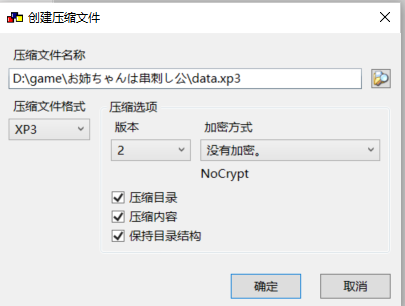

未知原因无法识别patch.xp3，只能整包。

realse中为整包，如果不想下载600多mb的整包，可以自己用Garbro封包。下载本仓库中的代码，用Garbro解压data.xp3，用transed_ks中的文件将解压出来的k_scenario文件夹中的ks文件替换，再用Garbro打包，注意备份好原文件（Garbro**打开**解包出的文件夹，全选，右键选择创建压缩文件）。然后将补丁文件夹中的其他文件复制到安装目录中（这些文件只是为了不用手动转区）。

未经过校对、选项和人名未翻译。

点击原exe进行启动即可，无需手动转区。

使用了Garbro进行解、封包，sextractor进行文本提取和导入，galtransl进行批量翻译，UniversalInjectorFramework和Locale-Emulator进行转区。
